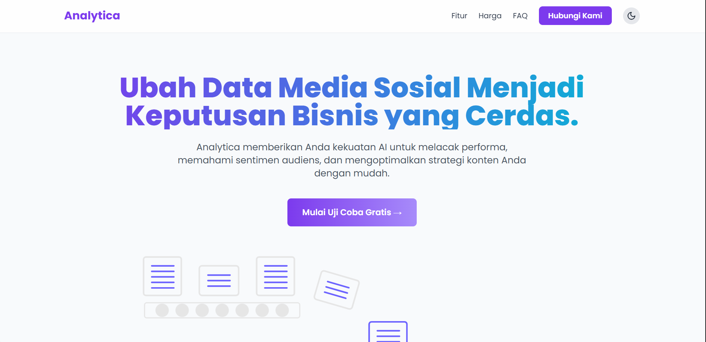
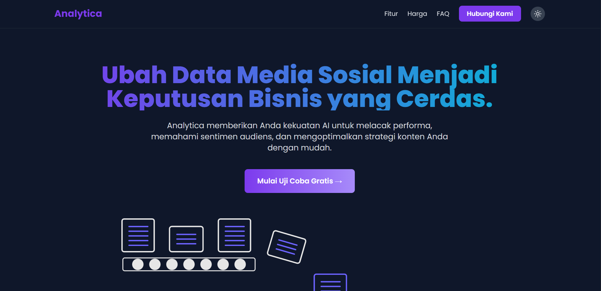

# Analytica - Landing Page Interaktif (Multi-Page)


Sebuah landing page modern dan sepenuhnya responsif untuk produk SaaS fiktif bernama "Analytica". Awalnya dibangun sebagai _single-page application_, proyek ini kemudian di-refactor menjadi _multi-page application_ menggunakan React Router dan ditingkatkan dengan berbagai fitur UI modern.

### [**➡️ Lihat Demo Live ⬅️**](https://AlvindraRamadhan.github.io/analytica-landing-page)

---




_(**Catatan:** Untuk menampilkan screenshot, ambil gambar terbaik dari demo live Anda, simpan dengan nama `screenshot.png` di folder utama proyek, lalu commit bersama file lainnya.)_

## Fitur Utama

- **Navigasi Multi-Halaman**: Menggunakan `React Router` untuk menciptakan pengalaman pengguna yang natural dengan URL yang unik untuk setiap halaman.
- **Desain Sepenuhnya Responsif**: Tampilan sempurna di perangkat desktop, tablet, dan mobile.
- **Mode Terang & Gelap (Dark Mode)**: Tombol untuk mengubah tema agar nyaman dilihat di berbagai kondisi pencahayaan, dengan state yang tersimpan di `localStorage`.
- **Animasi & Mikro-interaksi**: Animasi saat scroll dan efek _hover_ yang elegan menggunakan `Framer Motion` untuk memberikan pengalaman pengguna yang lebih hidup.
- **Tata Letak Dinamis**: Menggunakan pembatas section berbentuk gelombang (SVG) untuk transisi antar bagian yang lebih mulus.
- **Komponen Interaktif**: Termasuk _accordion_ untuk FAQ dan _pricing table_ yang menarik secara visual.
- **Formulir Kontak Fungsional**: Terintegrasi dengan Formspree untuk penanganan pengiriman formulir.

## Teknologi yang Digunakan

- **[React.js](https://reactjs.org/)**: Library JavaScript untuk membangun antarmuka pengguna.
- **[React Router](https://reactrouter.com/)**: Library standar untuk routing di aplikasi React.
- **[Vite](https://vitejs.dev/)**: Build tool modern untuk pengalaman pengembangan yang cepat.
- **[Tailwind CSS](https://tailwindcss.com/)**: Framework CSS utility-first untuk desain yang cepat dan kustom.
- **[Framer Motion](https://www.framer.com/motion/)**: Library animasi untuk React.
- **[Lucide React](https://lucide.dev/)**: Library ikon yang bersih dan konsisten.
- **[Formspree](https://formspree.io/)**: Layanan backend untuk formulir HTML.

## Instalasi dan Menjalankan Proyek Lokal

1.  **Clone repository ini**
    ```sh
    git clone [https://github.com/AlvindraRamadhan/analytica-landing-page.git](https://github.com/AlvindraRamadhan/analytica-landing-page.git)
    ```
2.  **Masuk ke direktori proyek**
    ```sh
    cd analytica-landing-page
    ```
3.  **Install semua dependensi**
    ```sh
    npm install
    ```
4.  **Jalankan server pengembangan**
    ```sh
    npm run dev
    ```
    Buka `http://localhost:5173` atau alamat yang muncul di terminal Anda.

## Kontak

**Alvindra Ramadhan**

- **GitHub**: [AlvindraRamadhan](https://github.com/AlvindraRamadhan)
- **LinkedIn**: [alvindra-ramadhan](https://www.linkedin.com/in/alvindra-ramadhan)
