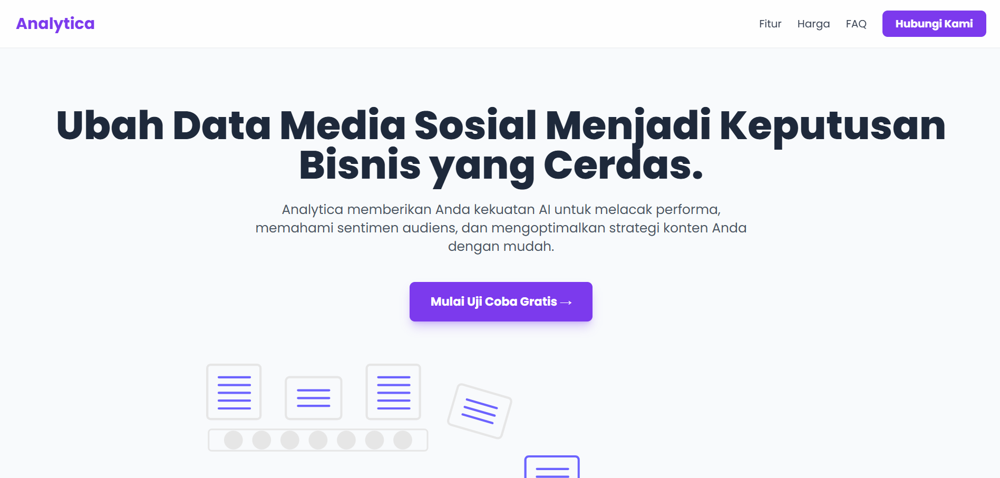
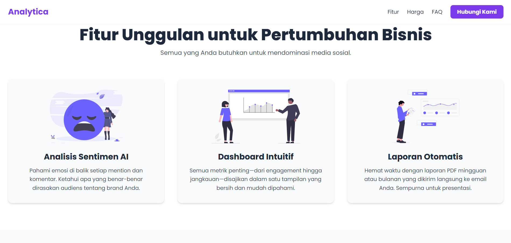
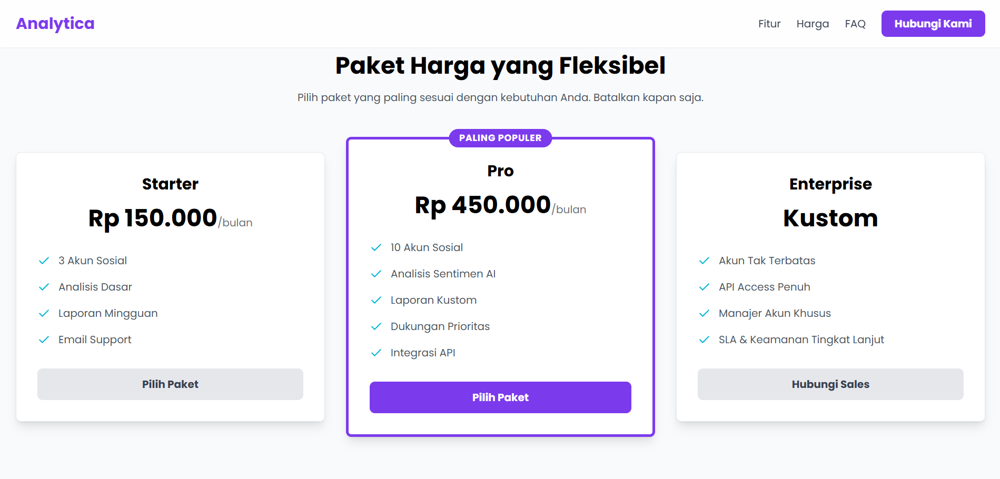
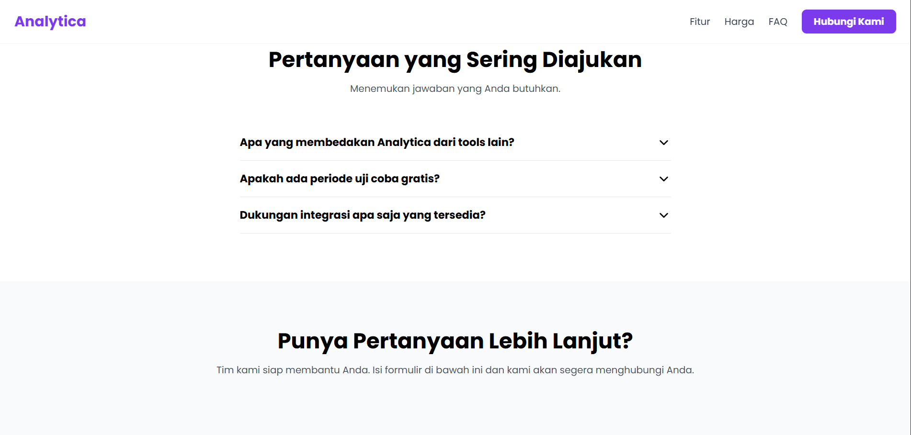
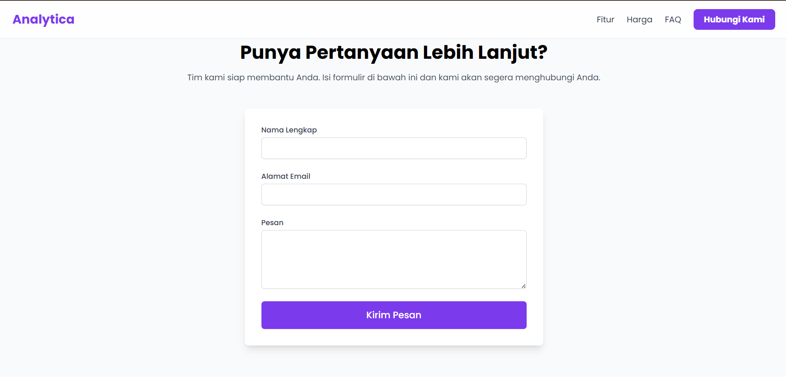

# Analytica - Landing Page Interaktif


Sebuah landing page modern dan sepenuhnya responsif untuk produk SaaS fiktif bernama "Analytica". Proyek ini dibuat untuk menunjukkan kemampuan dalam membangun antarmuka pengguna yang menarik dan fungsional menggunakan teknologi frontend modern.

### [**➡️ Lihat Demo Live ⬅️**](https://AlvindraRamadhan.github.io/analytica-landing-page)

---







## Fitur Utama

- **Desain Sepenuhnya Responsif**: Tampilan yang sempurna di perangkat desktop, tablet, dan mobile, dibangun dengan pendekatan _mobile-first_.
- **Animasi Halus**: Animasi saat scroll yang elegan menggunakan `Framer Motion` untuk memberikan pengalaman pengguna yang lebih hidup.
- **Komponen Interaktif**: Termasuk komponen seperti _accordion_ untuk FAQ dan _pricing table_ yang menarik secara visual.
- **Formulir Kontak Fungsional**: Terintegrasi dengan Formspree untuk penanganan pengiriman formulir tanpa memerlukan backend kustom.
- **Branding & Desain Kustom**: Menggunakan palet warna dan tipografi yang dipilih secara personal untuk menciptakan identitas visual yang unik.

## Teknologi yang Digunakan

- **[React.js](https://reactjs.org/)**: Library JavaScript untuk membangun antarmuka pengguna.
- **[Vite](https://vitejs.dev/)**: Build tool modern yang memberikan pengalaman pengembangan super cepat.
- **[Tailwind CSS](https://tailwindcss.com/)**: Framework CSS utility-first untuk desain yang cepat dan kustom.
- **[Framer Motion](https://www.framer.com/motion/)**: Library animasi untuk React.
- **[Lucide React](https://lucide.dev/)**: Library ikon yang bersih dan konsisten.
- **[Formspree](https://formspree.io/)**: Layanan backend untuk formulir HTML.

## Instalasi dan Menjalankan Proyek Lokal

Untuk menjalankan proyek ini di mesin lokal Anda, ikuti langkah-langkah berikut:

1.  **Clone repository ini**
    ```sh
    git clone [https://github.com/AlvindraRamadhan/analytica-landing-page.git]
    ```
2.  **Masuk ke direktori proyek**
    ```sh
    cd analytica-landing-page
    ```
3.  **Install semua dependensi**
    ```sh
    npm install
    ```
4.  **Jalankan server pengembangan**
    ```sh
    npm run dev
    ```
    Buka `http://localhost:5173` di browser Anda.

## Kontak

**Alvindra Ramadhan**

- **GitHub**: [AlvindraRamadhan](https://github.com/AlvindraRamadhan)
- **LinkedIn**: [alvindra-ramadhan](https://www.linkedin.com/in/alvindra-ramadhan)
